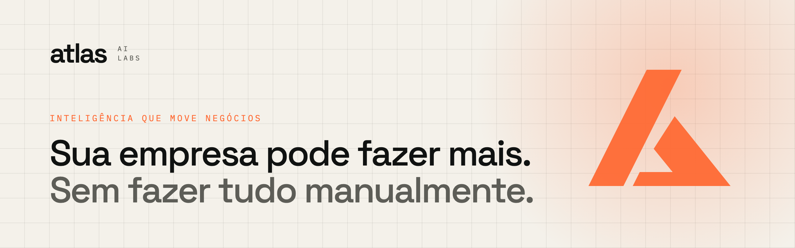
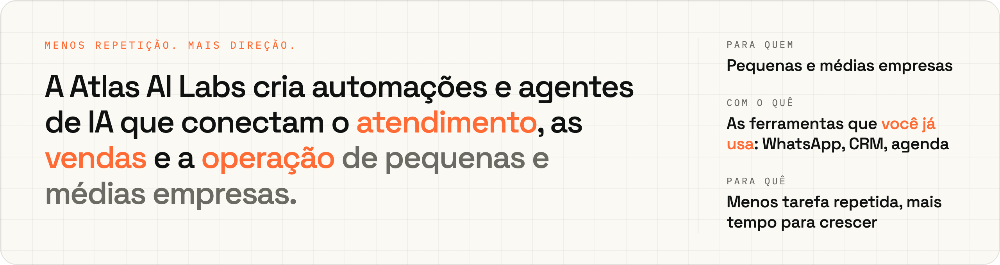
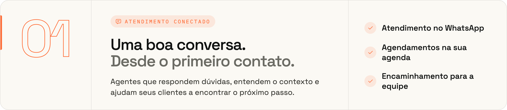
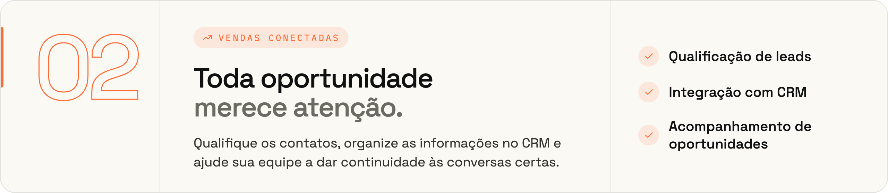
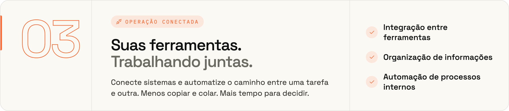
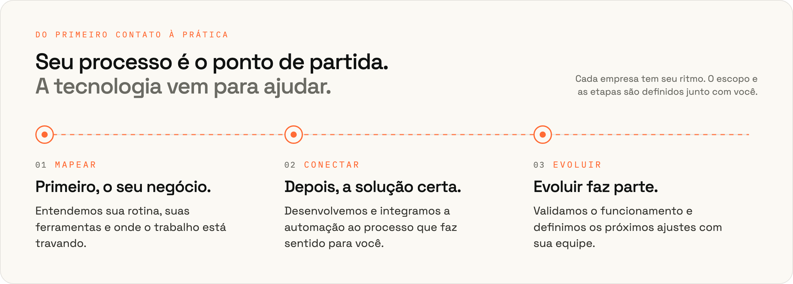
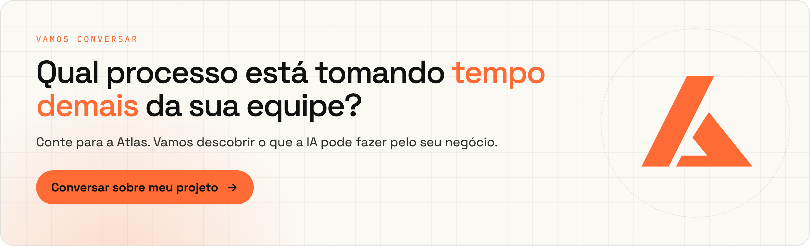

<picture>
  <source media="(prefers-color-scheme: dark)" srcset="assets/banner-dark.png">
  
</picture>

 

<picture>
  <source media="(prefers-color-scheme: dark)" srcset="assets/intro-dark.png">
  
</picture>

### O que fazemos

<picture>
  <source media="(prefers-color-scheme: dark)" srcset="assets/service-1-dark.png">
  
</picture>

<picture>
  <source media="(prefers-color-scheme: dark)" srcset="assets/service-2-dark.png">
  
</picture>

<picture>
  <source media="(prefers-color-scheme: dark)" srcset="assets/service-3-dark.png">
  
</picture>

### Como trabalhamos

<picture>
  <source media="(prefers-color-scheme: dark)" srcset="assets/process-dark.png">
  
</picture>

 

<a href="https://wa.me/5511936182467?text=Ol%C3%A1!%20Vim%20pelo%20GitHub%20da%20Atlas%20AI%20Labs%20e%20gostaria%20de%20conversar%20sobre%20automa%C3%A7%C3%B5es%20e%20agentes%20de%20IA%20para%20minha%20empresa.">
<picture>
  <source media="(prefers-color-scheme: dark)" srcset="assets/closing-dark.png">
  
</picture>
</a>

  

